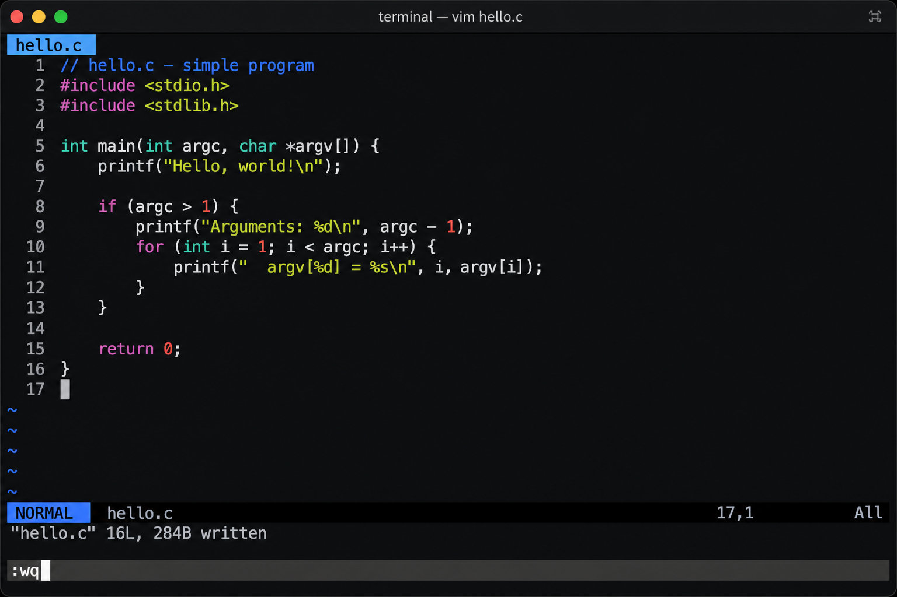

# Terminal Text Editor

A curses-based CLI text editor built as a systems programming capstone in Python.

Released under the [MIT License](LICENSE).

The project is intentionally terminal-only. There is no Django, Flask, HTMX,
database, or web dashboard because the learning goal is direct control of the
terminal boundary: screen redraws, cursor placement, key decoding, command
dispatch, file I/O, and undo history.

## Install

```powershell
python -m pip install -e ".[dev]"
```

On Windows, the project depends on `windows-curses`, which is installed through
the platform-specific dependency in `pyproject.toml`.

For a reproducible, fully pinned environment, install from the lockfiles instead:

```powershell
python -m pip install -r requirements-dev.txt
python -m pip install -e . --no-deps
```

For runtime-only installs (no dev tools), use `requirements.txt` instead of
`requirements-dev.txt`.

`requirements-dev.txt` and `requirements.txt` are generated from `pyproject.toml`
with `pip-compile` (regenerate with
`pip-compile --extra dev -o requirements-dev.txt pyproject.toml` and
`pip-compile -o requirements.txt pyproject.toml`).
The lockfile headers record the Python version used to compile them; CI installs
the unpinned range from `pyproject.toml` so it also catches new dependency releases.

The PyPI package name is `terminal-text-editor`, but the importable module is
`text_editor` and the CLI command is `text-editor`.

## Run

```powershell
text-editor
text-editor notes.txt
python -m text_editor notes.txt
```

Use a real terminal rather than an IDE embedded console. Curses key codes and
resize behavior vary between terminal hosts.

## Demo



A typical session looks like this:

```text
$ text-editor notes.txt
  notes.txt | 1 lines | Ln 1, Col 1 | EDIT | ^S Save ^Q Quit ^P Cmd
  hello world
  ─────────────────────────────────────────────────────────────────
  :find world          → 1 match, cursor on "world"
  ^S                   → saved notes.txt
  ^Q                   → exit
```

CORE requirements are summarized in [docs/REQUIREMENTS.md](docs/REQUIREMENTS.md) (the canonical
in-repo spec; full scope documents may exist locally but are gitignored).
Architecture decisions are recorded under [docs/adr/](docs/adr/).
See [CHANGELOG.md](CHANGELOG.md) for release history.

## Exit Codes

| Code | Meaning |
| --- | --- |
| 0 | Normal exit |
| 1 | curses is unavailable (for example `windows-curses` is not installed on Windows) |
| 2 | Usage error from invalid command-line arguments |

## Default Keys

| Key | Action |
| --- | --- |
| Arrow keys | Move cursor |
| Home / End | Move to start or end of line |
| PageUp / PageDown | Move by one visible page |
| Enter | Split line |
| Backspace / Delete | Delete before or at cursor |
| Tab | Insert spaces or a tab based on config |
| Ctrl-S | Save |
| Ctrl-Q | Quit, with dirty-buffer warning |
| Ctrl-F | Search |
| Ctrl-N / Ctrl-B | Next / previous search match |
| Ctrl-P | Command mode |
| Ctrl-Z / Ctrl-Y | Undo / redo |
| Ctrl-G | Help summary |

## Command Mode

Open command mode with `Ctrl-P`. Supported commands:

```text
:open path/to/file.txt
:write
:w
:saveas path/to/new-file.txt
:quit
:q
:quit!
:wq
:find text
:next
:prev
:goto 120
:set tab_width=4
:set expand_tabs=true
:help
```

The command parser is separate from curses and returns a structured
`CommandRequest` with command name, positional arguments, option assignments,
raw input, and validation errors. It handles quoted paths and terms through
`shlex`.

## Config

The editor loads `~/.config/text-editor/config.toml` by default, or another path
passed through `--config`. This location is used on every platform (it is not
remapped to `%APPDATA%` on Windows). Passing `--config` to a file that does not
exist reports a warning rather than silently using defaults.

```toml
[editor]
tab_width = 4
expand_tabs = true
line_ending_policy = "preserve" # preserve, lf, crlf
search_case_sensitive = false
keymap_name = "default"
show_status_hints = true
ensure_trailing_newline = true
```

Invalid config entries produce readable warnings and fall back to defaults.

`keymap_name` selects a binding table from the keymap registry. Only `default` is
registered today. Unknown names in a config file warn and fall back; `:set
keymap_name=…` accepts only registered names. `ensure_trailing_newline` makes saves
end with a final newline (POSIX convention) when the buffer has been edited; set
it to `false` to write the buffer exactly as-is. A clean buffer is not rewritten
by `:write` or `Ctrl-S` (see `:wq` for save-and-quit).

## Architecture

The code uses a `src/` layout and keeps curses isolated from core logic:

| Module | Responsibility |
| --- | --- |
| `buffer.py` | Array-of-lines text model and edit primitives |
| `cursor.py` | Cursor movement and sticky-column rules |
| `viewport.py` | Vertical and horizontal scrolling math |
| `commands.py` | Named editor commands |
| `command_parser.py` | Command-mode parser |
| `keymap.py` | Data-driven key binding table |
| `undo.py` | Reversible edit command history |
| `search.py` | Search matches and navigation |
| `fileio.py` | UTF-8 open and atomic save |
| `config.py` | Config object and validation |
| `display.py` | Tab, wide-character, and control-char display math |
| `state.py` | Editor state, modes, and dirty tracking |
| `errors.py` | User-facing exception hierarchy |
| `render.py` | Thin curses drawing adapter |
| `app.py` | Curses setup, main loop, and input decoding |

The text buffer is an array of lines: `list[str]`. This is honest, simple,
testable, and fast enough for ordinary files. It is less efficient for huge
files and very long single lines because inserts and deletes can copy string
data and shift list elements. A gap buffer or piece table would improve some
large-edit patterns, but would add complexity that is not needed for the core
capstone.

## Cursor And Viewport Rules

Cursor movement clamps to valid buffer positions. Left and right wrap across
line boundaries where appropriate. Up and down preserve a sticky column so
moving through short lines and then back to longer lines feels natural.

The viewport stores vertical row offset and horizontal visual-column offset.
Tabs are expanded with the configured tab width for rendering and cursor
placement.

## Redraw Strategy

The renderer redraws only the visible frame: visible buffer rows, status bar,
and message bar. It does not iterate over the whole file just because the file
exists. The curses adapter uses `noutrefresh()` plus `doupdate()` so curses can
batch screen changes and reduce flicker.

## Undo And Redo

Undo/redo uses reversible command objects. Insert and delete edits know how to
undo and redo themselves against the buffer. The history maintains undo and redo
stacks, invalidates redo after new edits, and groups continuous typed characters
into one undo step. Cursor movement, newlines, and deletes break typed groups.

Dirty state is recomputed against the last saved text after undo and redo so
returning to the saved content clears the modified indicator.

The history is bounded to the most recent 1000 edits so memory stays in check on
long sessions; older edits beyond that limit are dropped.

## File I/O

Files are opened as UTF-8. The buffer preserves the detected line ending where
practical and tracks whether the file had a trailing newline.

Normal saves are atomic: write to a temporary file in the target directory,
flush, `fsync`, and then replace the destination with `os.replace`. This avoids
leaving a partially overwritten original file if a write fails midway.

A few details make the atomic save behave like the original write would:

- The original file's permission bits are copied onto the replacement, so saving
  does not strip them (for example, the executable bit on a script).
- If the path is a symlink, the save writes through to the real target rather
  than replacing the link with a regular file.
- On POSIX, the target directory is fsync'd after the rename so the replacement
  is durable, not just the file contents.

## Search

Search works from both `Ctrl-F` and `:find`. `Ctrl-F` is incremental: matches are
located and highlighted live as you type, anchored to where the search started,
and cancelling with `Esc` returns to the original cursor position. Matches are
tracked as line and column positions, next and previous wrap around, and the
current match is highlighted in the visible frame.

## Error Handling

Handled errors are shown in the message bar instead of crashing the terminal.
The app uses `curses.wrapper`, which restores terminal modes on normal exits and
uncaught exceptions.

The terminal is put into raw mode so control keys such as `Ctrl-S`, `Ctrl-Q`, and
`Ctrl-Z` are delivered to the editor instead of being intercepted by the host
terminal's flow control (XON/XOFF) or job control. `curses.wrapper` restores the
original terminal state on exit.

## Testing

The test suite exercises the core logic without a live terminal (**253 tests**,
**99% line coverage**, 4 skipped on platforms without POSIX permission semantics):

```powershell
python -m pytest
python -m pytest --cov=text_editor --cov-report=term-missing
```

Covered areas include buffer operations, cursor movement, viewport scrolling,
command parsing and dispatch, config validation, undo/redo grouping, search
navigation, file I/O helpers, key dispatch, app main loop, entry points, and
rendering (against a fake screen, so no terminal is required). Linting and type
checking round out the checks:

```powershell
python -m ruff check src tests
python -m mypy
```

`ruff`, `mypy`, and `pytest` (with `--cov-fail-under=98`) run in CI on Linux and
Windows for Python 3.11 and 3.12 (see `.github/workflows/ci.yml`).

## Known Limitations

This is not Vim, Emacs, or an IDE. It intentionally omits mouse support,
language servers, project indexing, split panes, plugin systems, collaborative
editing, full Unicode grapheme-cluster editing, and encryption as a central
feature.

Rendering accounts for East Asian wide characters (two columns) and replaces
control characters with a visible placeholder so untrusted files cannot inject
terminal escape sequences, but zero-width and combining marks are not given
grapheme-cluster treatment. Files are opened UTF-8 only (a leading byte-order
mark is stripped), and very large files are rejected up front because the buffer
is held entirely in memory. Files that mix `\n`, `\r\n`, and `\r` are normalized
internally to the first detected style and saved with a single line-ending policy.
